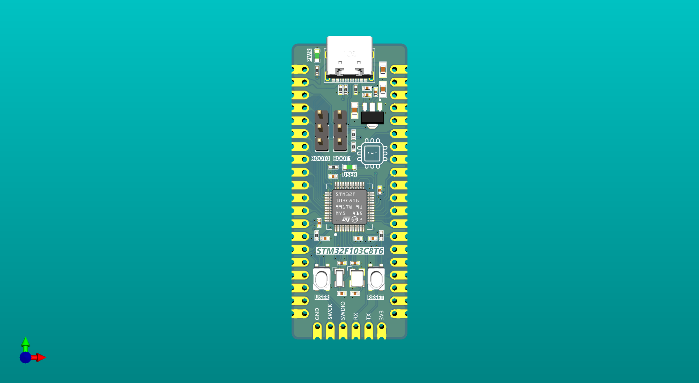
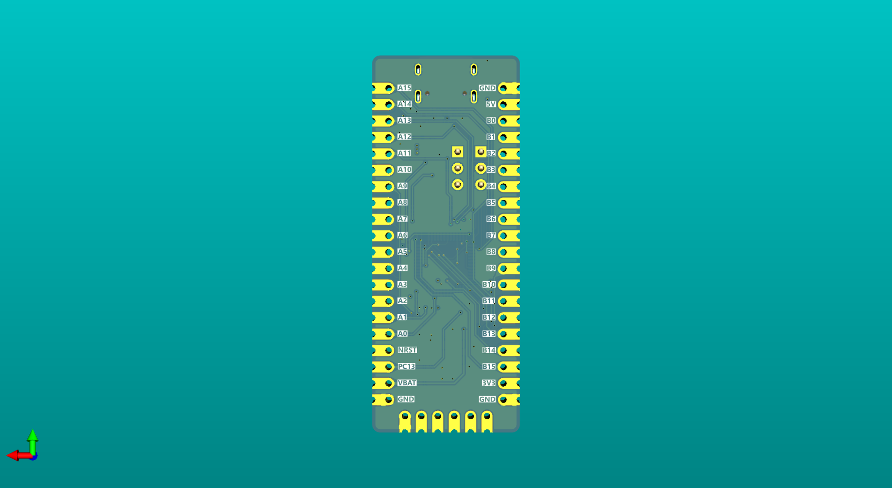

## What is this?

This is a customized development board for STM32F103C8T6 Microcontroller. It can be powered and communicated to PC using the USB-C cable in USB 2.0 highspeed. The small size also allows to fit nicely either on a breadboard or as a module on your pcb.

## How to open the project?

Use Kicad 9.0+ versions to open the project.
